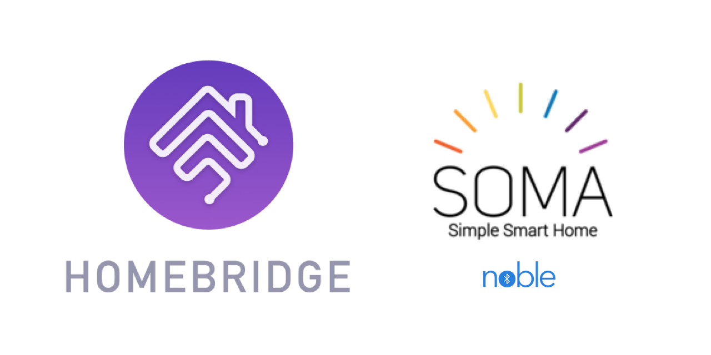

<p align="center">
    
</p>
<span align="center">

# Homebridge SOMA
[](https://www.npmjs.com/package/homebridge-soma)
[](https://www.npmjs.com/package/homebridge-soma)
[](https://discord.gg/yGvADWt)
<!-- [](https://github.com/homebridge/homebridge/wiki/Verified-Plugins) -->

[](https://github.com/ebaauw/homebridge-soma/issues)
[](https://github.com/ebaauw/homebridge-soma/pulls)
[](https://standardjs.com)

</span>

## Homebridge plugin for SOMA devices
Copyright © 2021 Erik Baauw. All rights reserved.

This **experimental** [Homebridge](https://github.com/homebridge/homebridge) plugin
aspires to expose
[SOMA Smart Shades 2](https://eu.somasmarthome.com) and
[SOMA Tilt 2](https://eu.somasmarthome.com/pages/smart-tilt) devices,
natively over Bluetooth Low Energy (BLE),
to Apple's [HomeKit](https://www.apple.com/ios/home/).

### Work in Progress
This plugin is still under development.
It is my first venture into Bluetooth, so I expect some ironing before it
will be stable.
If you're looking for a stable plugin, check out
[Homebridge SC](https://github.com/ebaauw/homebridge-sc).

Currently, Homebridge SOMA provides the following features:
- Automatic discovery of SOMA devices.  Each device is exposed as a HomeKit
accessory with a _Window Covering_, a _Light Sensor_, and a _Battery_ service.
The _Window Covering_ service carries custom characteristics _Close Upwards_
(for Tilt devices), _Last Seen_, _Log Level_,
and _Morning Mode_ (not yet implemented);
- Updating _Current Position_ and _Battery Level_ from the BLE advertisements;
- Setting the position through _Target Position_ and, for Tilt devices,
_Close Upwards_;
- Stopping current movement through _Hold Position_;
- Playing a sound on the device on _Identify_;
- Polling the device every 5 minutes for _Battery Charging State_ and
_Current Ambient Light Level_.  Note that _Current Ambient Light Level_
currently reports the raw value reported by the solar panel.

The `discover` and `probe` commands of the `ble` and `soma` command-line tools
are functional.

Still to do:
- Variable polling rate (through _Heartrate_ characteristic);
- Implement _Morning Mode_;
- Allow changing the motor speed from HomeKit;
- Sync the device clock, for when you don't use the Smart Shades app
nor SOMA Connect.
- Report sunrise and sunset times as computed by the device;
- Expose a custom service per trigger to enable/disable the trigger from HomeKit.
- Additional commands for `soma` to interact with the device from the command
line and/or shell scripts.

### Bluetooth Low Energy (BLE)
This plugin communicates to the SOMA devices over Bluetooth Low Energy (BLE).
While their Bluetooth API hasn't been published, Wazombi Labs OÜ have been very
helpful providing me the information needed to communicate with the SOMA devices.

This plugin uses [Noble](https://github.com/abandonware/noble) to access BLE
from NodeJS.
While no longer maintained by its original authors, the
[Abandonware](https://abandonware.github.io) community have adopted Noble.
It seems to run fine on a Raspberry Pi.
On macOS, discovering and monitoring a shade works, but reading or controlling
it seems to fail.
I don't have Windows, nor Docker, nor any other container, nor VMs to test, but
there seem plenty of open issues trying to run Noble on these.

Bottom line: this plugin is supported only running natively on a Raspberry Pi.
Obviously, this should be a Pi with BLE hardware, such as the 4B, 3B+, 3B, 3A+,
or Zero W.
I have no experience using USB dongles for BLE support on older models.

If you don't want to run a Raspberry Pi, check out
[Homebridge SC](https://github.com/ebaauw/homebridge-sc), which uses the
SOMA Connect instead of BLE to communicate with the SOMA devices.

Before installing this plugin, be sure to install Noble's dependencies:
```
sudo apt-get install bluetooth bluez libbluetooth-dev libudev-dev
```
and to allow NodeJS to access the BLE hardware:
```
sudo setcap cap_net_raw+eip $(eval readlink -f `which node`)
```
Note that this command needs to be repeated after each update of NodeJS.

### Command-Line Tool
Homebridge SOMA includes two command-line tools, `ble`, to interact with generic
BLE devices, and `soma` to interact with SOMA devices specifically.
Both tools take a `-h` or `--help` argument to provide a brief overview of
their functionality and command-line arguments.

### Configuration
In Homebridge's `config.json` you need to specify Homebridge SOMA as a platform
plugin.
```json
  "platforms": [
    {
      "platform": "SOMA"
    }
  ]
```
